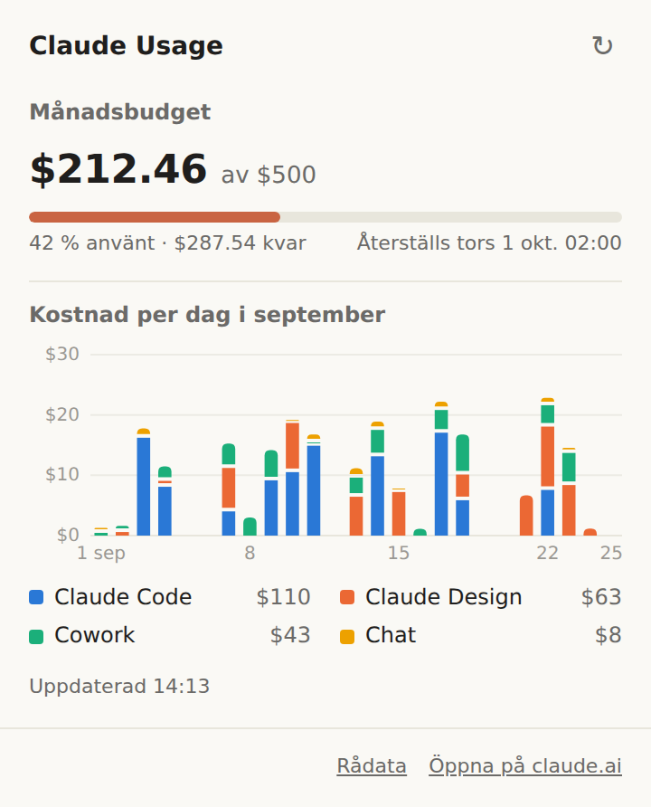
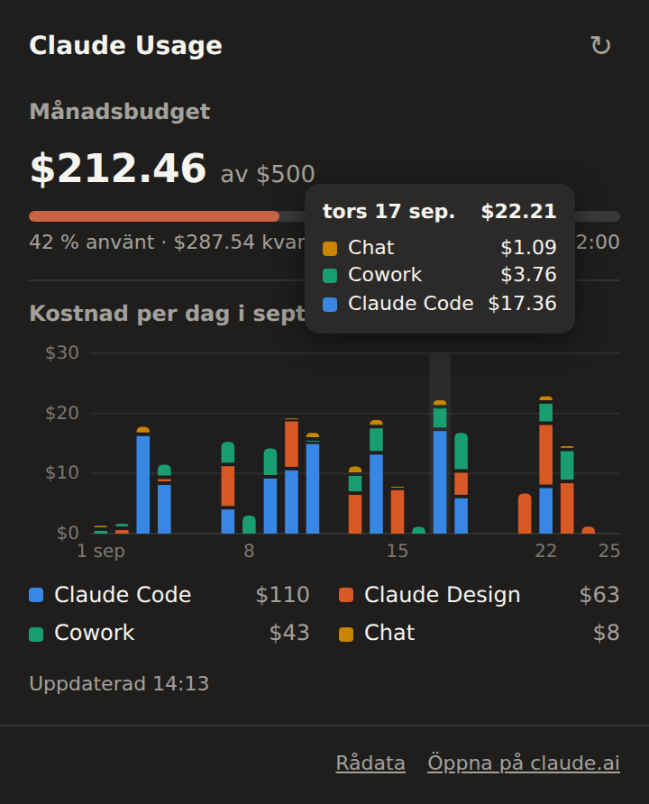
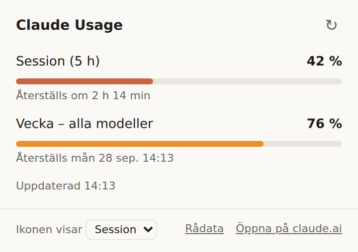

# Claude Usage – Chrome-tillägg

Visar hur mycket av din Claude-usage du har använt, direkt på ikonen i Chromes verktygsfält, utan att du behöver gå in på claude.ai.

  
  
  

*Skärmbilderna visar påhittade siffror.*

- **Enterprise-konton med månadsbudget:** spenderat belopp av budgeten, hur mycket som är kvar, när budgeten återställs och en graf över kostnad per dag och produkt (Claude Code, Claude Design, Cowork, Chat).
- **Pro- och Max-konton:** session- och veckogränserna i procent och när de återställs.
- Ikonen visar procent använt och byter färg från 70 % och 90 %. Siffrorna uppdateras var 5:e minut.

Varje användare ser sin egen data. Tillägget läser från den claude.ai-inloggning som finns i webbläsaren.

## Installera

1. Ladda ner den senaste zip-filen under **Releases** till höger på den här sidan, eller klicka på **Code → Download ZIP**.
2. Packa upp zip-filen till en mapp som du låter ligga kvar, till exempel i Dokument.
3. Gå till `chrome://extensions` och slå på **Utvecklarläge** uppe till höger.
4. Klicka på **Läs in okomprimerat** och välj mappen, alltså den som innehåller `manifest.json`.
5. Fäst tillägget i verktygsfältet via pusselikonen och se till att du är inloggad på claude.ai.

### Uppdatera till en ny version

Ladda ner den nya versionen och ersätt filerna i samma mapp. Klicka sedan på uppdateringspilen på tilläggets kort i `chrome://extensions`.

## Integritet och säkerhet

- Tillägget har bara behörighet till `https://claude.ai/*`.
- Det anropar bara claude.ai:s egna gränssnitt för usage och kostnader, med din befintliga inloggning.
- Ingen data skickas någon annanstans. Den senaste hämtningen sparas lokalt i webbläsaren (`chrome.storage.local`).
- Koden består av två små filer, `background.js` och `popup.js`, utan externa bibliotek. Läs gärna igenom dem.

## Begränsningar

- Tillägget använder interna gränssnitt på claude.ai som Anthropic inte har dokumenterat. De kan ändras utan förvarning, och då kan tillägget sluta fungera.
- Summan per produkt kan skilja sig något från budgetens spenderade belopp. Claude.ai:s egen graf har samma skillnad.

## Felsökning

- **"!" på ikonen:** Du är inte inloggad på claude.ai, eller så gick hämtningen inte att göra. Logga in och klicka på ↻ i rutan.
- **Fel eller saknade siffror:** Klicka på **Rådata** längst ner i rutan och bifoga det som kopierades när du rapporterar felet. Du kan byta ut ID:t för organisationen mot `XXX` om du vill.

## Filer

| Fil | Innehåll |
|---|---|
| `manifest.json` | Tilläggets inställningar och behörigheter |
| `background.js` | Hämtar data var 5:e minut och uppdaterar ikonen |
| `popup.html` / `popup.js` | Rutan som öppnas när du klickar på ikonen |
| `icons/` | Ikoner |
